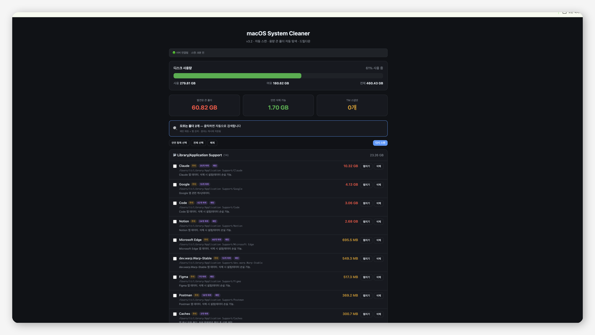

<div align="center">

# 🧹 macOS System Cleaner

**macOS 시스템 데이터를 자동으로 스캔하고 불필요한 캐시/빌드 파일을 정리하는 도구**

[](https://www.apple.com/macos/)
[](https://www.python.org/)
[](LICENSE)
[](https://github.com/duckey-kim/mac-system-cleaner/releases)

**[한국어](#-한국어) | [English](#-english)**

<!-- 스크린샷이 있다면 여기에 추가 -->
<!--  -->

</div>

---

## 🇰🇷 한국어

### ✨ 주요 기능

| 기능 | 설명 |
|------|------|
| 🔍 **자동 스캔** | 디스크 용량을 많이 차지하는 폴더 자동 탐색 |
| 🛠 **개발 도구 인식** | Xcode, Android Studio, Flutter, Homebrew, npm, pip 등 40+ 개발 도구 캐시 인식 |
| 📂 **드릴다운** | 하위 폴더 무한 탐색, 크기 비율 시각화 |
| 🚦 **안전도 표시** | 안전 / 주의 / 위험 3단계 + 폴더별 상세 설명 |
| 🔐 **sudo 삭제** | macOS 네이티브 비밀번호 입력으로 권한 필요 파일 삭제 |
| ⚡ **병렬 처리** | 스캔/드릴다운 동시 실행으로 빠른 분석 |
| 🌐 **폴더 자동 검색** | 모르는 폴더를 패턴 매칭 + 웹 검색으로 자동 설명 |
| 🔄 **자동 업데이트** | 앱 버전 + 폴더 DB 자동 업데이트 확인 |

### 🚀 시작하기

#### 방법 1: Python으로 직접 실행

```bash
git clone https://github.com/duckey-kim/mac-system-cleaner.git
cd mac-system-cleaner
python3 run.py
```

> 브라우저에서 `http://localhost:8787`이 자동으로 열립니다.

#### 방법 2: .app 번들로 빌드

```bash
chmod +x build_app.sh
./build_app.sh
```

> 빌드 후 `dist/System Cleaner.app`을 더블클릭하거나 Applications에 복사하세요.

### 📁 프로젝트 구조

```
mac-system-cleaner/
├── run.py                    # 엔트리 포인트
├── build_app.sh              # .app 빌드 스크립트
├── .gitignore
├── README.md
└── app/
    ├── __init__.py
    ├── config.py              # 설정, 버전, 폴더 DB 로드
    ├── scanner.py             # 파일 시스템 스캔 (병렬)
    ├── cleaner.py             # 파일 삭제 (일반 + sudo)
    ├── server.py              # HTTP 서버 + REST API
    ├── lookup.py              # 폴더 설명 자동 조회 (패턴 + 웹)
    ├── updater.py             # 자동 업데이트 모듈
    ├── learned_folders.json   # 폴더 정보 DB (자동 확장)
    └── web/
        └── index.html         # 프론트엔드 (Dark UI)
```

### 🔧 요구사항

- **macOS** 10.15 (Catalina) 이상
- **Python** 3.8 이상
- 외부 패키지 **불필요** (표준 라이브러리만 사용)
- `.app` 빌드 시 PyInstaller 필요 (빌드 스크립트가 자동 설치)

### 🧠 폴더 인식 시스템

이 도구는 3단계로 폴더 정보를 제공합니다:

1. **내장 DB** — 40+ 개발 도구/시스템 폴더 사전 등록
2. **패턴 매칭** — 번들 ID (`com.apple.*`), 키워드 (`cache`, `log`, `temp`) 자동 인식
3. **웹 검색** — DuckDuckGo API로 알 수 없는 폴더 자동 검색

검색 결과는 `learned_folders.json`에 영구 저장되어 다음 실행 시 바로 표시됩니다.

### ⌨️ 종료

- 터미널 실행: `Ctrl+C`
- .app 실행: 앱 종료

---

## 🇺🇸 English

### ✨ Features

| Feature | Description |
|---------|-------------|
| 🔍 **Auto Scan** | Automatically finds folders consuming the most disk space |
| 🛠 **Dev Tool Recognition** | Recognizes 40+ dev tool caches: Xcode, Android Studio, Flutter, npm, pip, etc. |
| 📂 **Drill-down** | Infinite subfolder exploration with size visualization |
| 🚦 **Safety Indicators** | Safe / Moderate / Caution levels with detailed descriptions |
| 🔐 **sudo Delete** | Native macOS password prompt for privileged file deletion |
| ⚡ **Parallel Processing** | Concurrent scan and drill-down for fast analysis |
| 🌐 **Auto Folder Lookup** | Unknown folders identified via pattern matching + web search |
| 🔄 **Auto Update** | Automatic app version + folder DB update checking |

### 🚀 Getting Started

#### Option 1: Run directly with Python

```bash
git clone https://github.com/duckey-kim/mac-system-cleaner.git
cd mac-system-cleaner
python3 run.py
```

> Browser will automatically open `http://localhost:8787`.

#### Option 2: Build as .app bundle

```bash
chmod +x build_app.sh
./build_app.sh
```

> After building, double-click `dist/System Cleaner.app` or copy to Applications.

### 📁 Project Structure

```
mac-system-cleaner/
├── run.py                    # Entry point
├── build_app.sh              # .app build script
├── .gitignore
├── README.md
└── app/
    ├── __init__.py
    ├── config.py              # Settings, version, folder DB loader
    ├── scanner.py             # File system scanning (parallel)
    ├── cleaner.py             # File deletion (normal + sudo)
    ├── server.py              # HTTP server + REST API
    ├── lookup.py              # Auto folder lookup (pattern + web)
    ├── updater.py             # Auto-update module
    ├── learned_folders.json   # Folder info DB (auto-expanding)
    └── web/
        └── index.html         # Frontend (Dark UI)
```

### 🔧 Requirements

- **macOS** 10.15 (Catalina) or later
- **Python** 3.8 or later
- **No external packages** required (stdlib only)
- PyInstaller needed for `.app` build (auto-installed by build script)

### 🧠 Folder Recognition System

This tool identifies folders through a 3-tier system:

1. **Built-in DB** — 40+ dev tool and system folders pre-registered
2. **Pattern Matching** — Bundle IDs (`com.apple.*`), keywords (`cache`, `log`, `temp`)
3. **Web Search** — DuckDuckGo API for unknown folders

Results are permanently saved to `learned_folders.json` and displayed instantly on next run.

### ⌨️ Quit

- Terminal: `Ctrl+C`
- .app: Close the app

---

<div align="center">

Made with ❤️ for macOS developers

</div>
